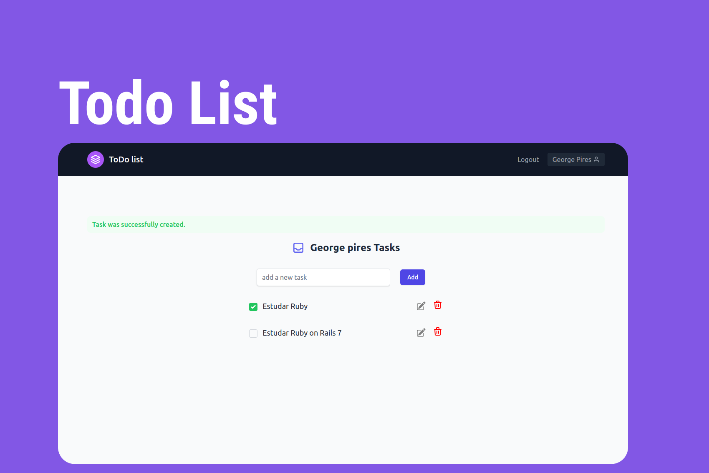

<br>
<div align="center">
    
</div>
<br>

## 💻 Projeto

 **ToDo List - Monte sua lista de tarefas!**

## 🚀 Tecnologias

- Ruby 3.1.2
- Rails 7.0.4
- PostgreSQL
- Hotwire - (Turbo e Stimulus)
- Tailwind CSS
- Esbuild
- Gem: Devise

## 💥 Funcionalidades

- [x] Cadastro e Login de usuários.
- [x] Gerenciamento de tarefas - CRUD. 

## ⚡ Instalando o Projeto

```bash
# clonar o projeto
git clone git@github.com:GeorgePires/todo_list.git

# entre no diretório clonado
cd todo_list

# instalar dependências do Ruby on Rails
bundle install

# instalar dependências do Node e esbuild
npm install

# criar os bancos de dados de desenvolvimento e teste
rails db:create

# criar as tabelas
rails db:migrate
```
```bash
# Crie um usuário de exemplo
rails db:seed

    - Admin: admin@gmail.com | senha: 123246
```

```bash
# executar o projeto
./bin/dev
```

Entre no endereço `http://localhost:3000`